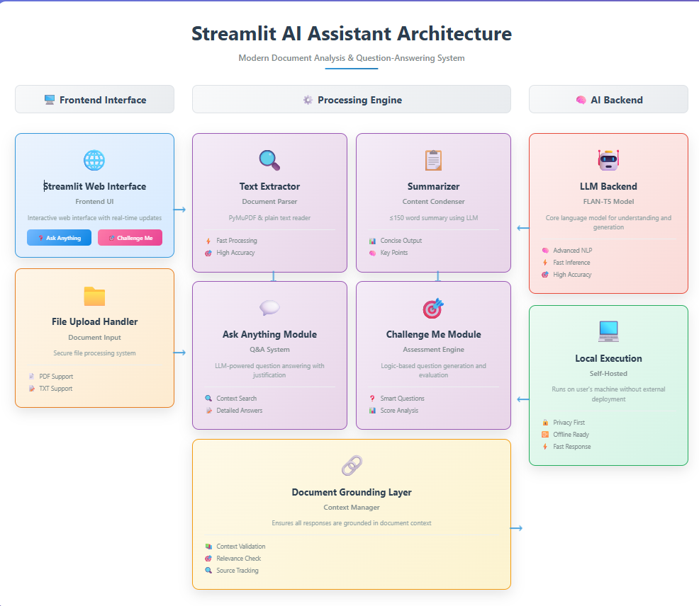
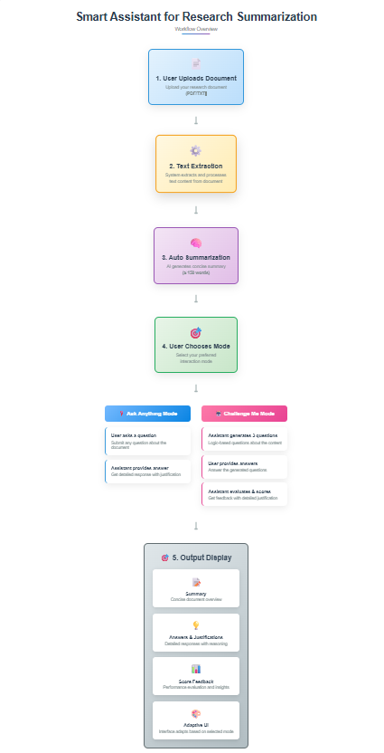
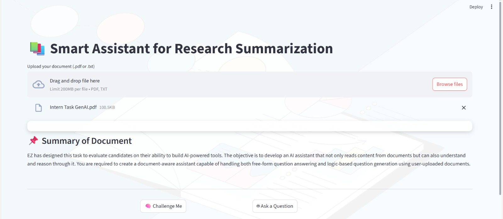
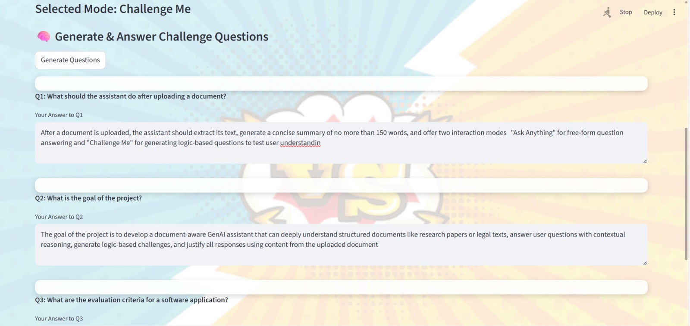
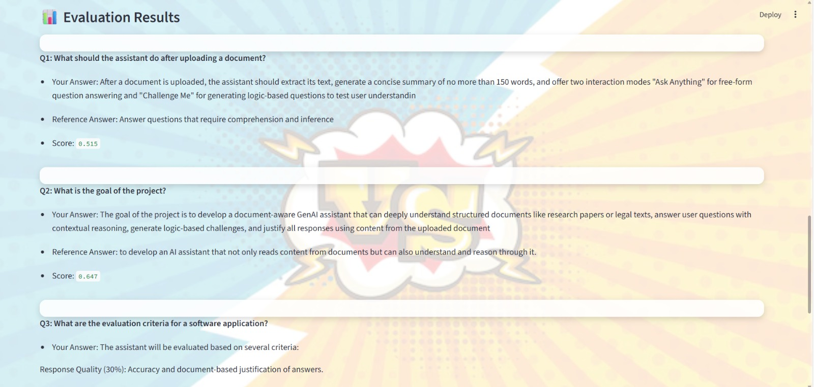
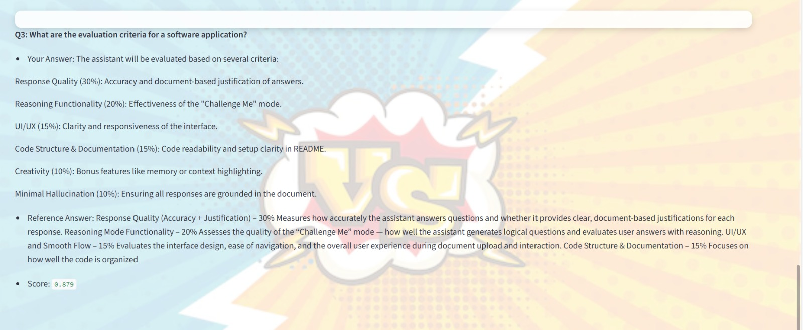
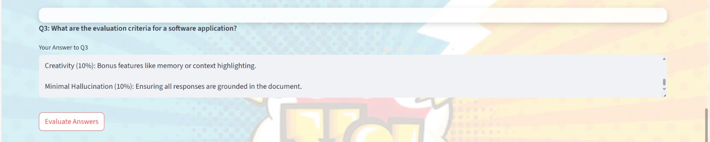
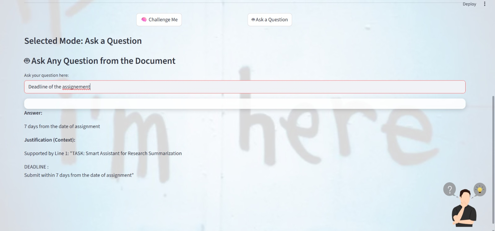

````markdown
 📚 Smart Assistant for Research Summarization

A GenAI-powered assistant that reads and understands documents (PDF/TXT) to:
- Answer user questions with contextual accuracy
- Generate logical challenge questions
- Evaluate user responses with detailed justifications

---

 🧠 Objective

This project was developed as part of an AI internship assignment to demonstrate:
- Deep comprehension of documents
- Reasoning and evaluation capabilities through question generation and answer analysis
- A clean, interactive user interface built using Streamlit

---

 🚀 Features

- Upload PDF or TXT files  
- Auto-generate concise document summaries (≤150 words)  
- Ask questions related to the document content  
- Receive logic-based challenge questions generated automatically  
- Get instant evaluation and justification for your answers  
- Grounded and justified answers to all user queries  
- Responsive backgrounds and image-rich UI for enhanced user experience  
- Runs locally with Streamlit — no cloud dependency

---

## 🏗️ Architecture



---

## 🔁 Workflow



---

## 🖥️ Output Samples

  
  
  
  
  
  

---

## 🛠️ Tech Stack

- Python  
- Streamlit for the web UI  
- FLAN-T5 (or similar) for question answering and reasoning  
- PyMuPDF / PDFReader for PDF text extraction  
- HuggingFace Transformers & SentenceTransformers for NLP tasks  

---

## 📂 How to Run Locally

1. **Clone the repository**
   ```bash
   git clone https://github.com/YOUR_USERNAME/SmartAssistanceAI.git
   cd SmartAssistanceAI
````

2. **Create and activate a virtual environment (optional but recommended)**

   ```bash
   python -m venv venv
   source venv/bin/activate   # On Windows use: venv\Scripts\activate
   ```

3. **Install dependencies**

   ```bash
   pip install -r requirements.txt
   ```

4. **Run the Streamlit app**

   ```bash
   streamlit run app.py
   ```

5. **Using the app**

   * Upload your PDF or TXT document
   * View the summary generated automatically
   * Ask questions or answer automatically generated challenge questions
   * Receive instant answers, evaluations, and justifications

---

## 🧩 Project Structure

```
SmartAssistanceAI/
├── app.py               # Main Streamlit app
├── utils.py             # Helper functions for text extraction, summarization, QA, evaluation
├── requirements.txt     # Python package dependencies
├── assests/             # Images for UI and documentation
├── sample_docs/         # Example PDF/TXT files
├── README.md            # Project documentation (this file)
```

---

## 🤝 Contributions

Contributions are welcome! Feel free to fork the repo, submit issues, or create pull requests.

---

## 🙋‍♀️ Contact

**Anushika Chauhan** — [anuchauhan1569@gmail.com](mailto:anuchauhan1569@gmail.com)
Feel free to reach out for questions or suggestions.

---

## 📜 License

This project is licensed under the MIT License.

---

*Thank you for exploring the Smart Assistant for Research Summarization project! 🚀*

```

---

You can copy this and replace your current README.md content with it!  
Anything else you want to add or tweak?
```
